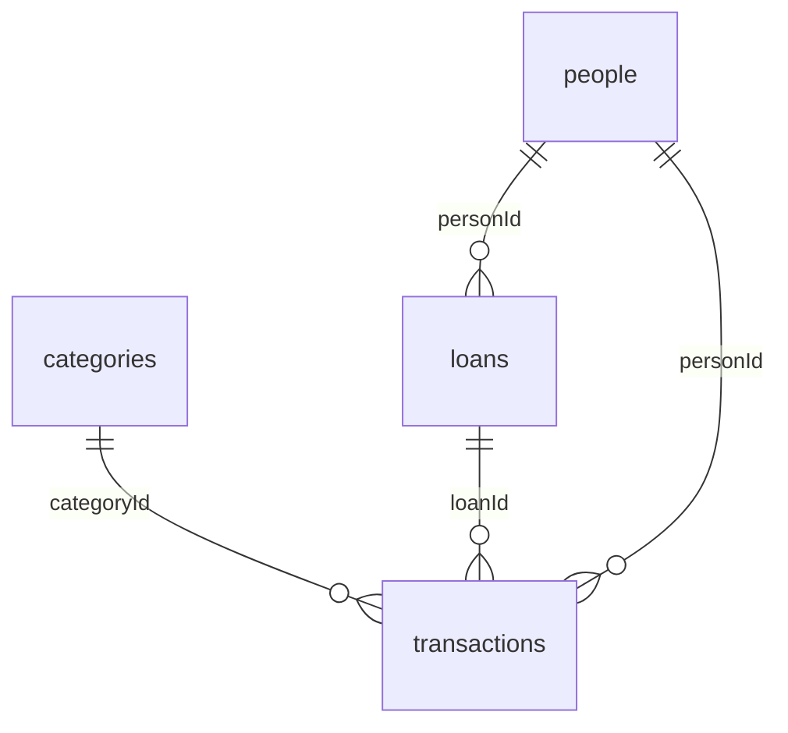

# BMM v6 — Firestore theo khuôn SQL (hướng B)

## Nguyên tắc
1. **Mỗi bảng SQL = một collection**, mỗi dòng = một document, **ID document = khóa chính**.
2. **Liên kết bằng ID** (`categoryId`, `personId`, `loanId`) như khóa ngoại — không còn liên kết bằng tên.
3. **ID toàn cục (UUID)**, không dùng số tự tăng của từng máy → hai máy không bao giờ ghi đè nhau.
4. **Mỗi dòng có `updatedAt` + `deleted`** → đồng bộ từng dòng (last-write-wins), không xóa-sạch-rồi-tải-lại.
5. **Không lưu trường suy ra được** (dayKey, monthKey, searchText, dư nợ) — máy tự tính.
6. Dữ liệu mới nằm ở **`accounts/{uid}`**, tách hẳn khỏi `users/{uid}` cũ → app bản hiện tại vẫn chạy trong lúc chuyển.

## Cấu trúc

```
accounts/{uid}                       hồ sơ: displayName, email, createdAt
accounts/{uid}/settings/app          1 doc cài đặt
accounts/{uid}/meta/sync             schemaVersion, counts, updatedAt (ghi sau cùng)
accounts/{uid}/categories/{uuid}
accounts/{uid}/people/{uuid}
accounts/{uid}/loans/{loanId}        giữ ID cũ "LMS…" (vốn đã là chuỗi ngẫu nhiên)
accounts/{uid}/transactions/{uuid}
```



## Các bảng

### categories
| Trường | Kiểu | Ghi chú | Room (`categories`) |
|---|---|---|---|
| id | string (UUID) | khóa chính | **cột mới `cloudId`** |
| name | string | duy nhất trong tài khoản | name |
| emoji | string? | | emoji |
| kind | `EXPENSE` \| `INCOME` \| `BOTH` | | kind |
| sortOrder | int | | sortOrder |
| archived | bool | | archived (0/1) |
| deleted | bool | xóa mềm | deleted (0/1) |
| updatedAt | int (epoch ms) | | updatedAt |

### people
| Trường | Kiểu | Room (`partners`) |
|---|---|---|
| id | string (UUID) | **`cloudId`** |
| name | string | name |
| phone, note | string? | phone, note |
| deleted, updatedAt | bool, int | deleted, updatedAt |

### loans
| Trường | Kiểu | Ghi chú | Room (`loans`) |
|---|---|---|---|
| id | string | `LMS…` | loanId (PK sẵn có) |
| personId | string → people.id | thay cho `partnerName` | partnerId (map qua cloudId) |
| direction | `BORROW` \| `LEND` | BORROW = mình vay | direction |
| principal | int (VND) | > 0 | principal |
| rate | number? | | rate |
| openedAt | int | cũ: openedDate | openedDate |
| dueAt | int? | **null = không hạn** (cũ lưu 0) | dueDate |
| settled, writtenOff | bool | | settled, writtenOff |
| deleted, updatedAt | bool, int | | |

### transactions
| Trường | Kiểu | Ghi chú | Room (`transactions`) |
|---|---|---|---|
| id | string (UUID) | | **`cloudId`** |
| type | `EXPENSE` `INCOME` `BORROW` `LEND` `REPAY` `COLLECT` | | type |
| amount | int (VND) | > 0 | amount |
| occurredAt | int | cũ: date | date |
| title | string | | title |
| note | string? | **đã tách phương thức thanh toán ra** | note |
| paymentMethod | `BANK` \| `CASH` \| `CARD` \| `EWALLET` \| `OTHER` \| null | cũ: nằm cuối note "· 🏦 Chuyển khoản" | **cột mới `paymentMethod`** |
| categoryId | string? → categories.id | cũ: categoryName | categoryId (map qua cloudId) |
| loanId | string? → loans.id | bắt buộc với BORROW/LEND/REPAY/COLLECT | loanId |
| personId | string? → people.id | với giao dịch vay = người của khoản vay | partnerId |
| deleted, updatedAt | bool, int | | |

Bỏ khỏi transactions: `dueDate`, `settled`, `writtenOff`, `rate`, `partnerName`, `categoryName` (trùng với loans/categories; 98/98 dòng hiện đều rỗng hoặc chép từ loan).

### settings/app
`userName, budget, warnPercent, bigPercent, cycleDay, cycleMonth, strongAlarm, reminders, updatedAt`

## Thay đổi phía Room (bước 4 — bản đã làm)
**Không đổi schema Room, không cần migration.** App dùng 1 máy nên ID cloud sinh cố định từ ID số cục bộ:
`id = UUIDv5(NS, "{uid}/{bảng}/{idSố}")` (giống convert.py) — loans giữ `loanId` dạng `LMS…`.
- `paymentMethod` tách/ghép với note bằng `util/PaymentNote.java` khi đẩy/kéo (note trong máy vẫn dạng cũ).
- Khi kéo về, dòng cloud được map về máy qua `legacyId`.
- Giới hạn: nếu sau này dùng 2 máy cùng lúc, ID số có thể trùng → khi đó mới cần thêm cột `cloudId`.

## Cách đồng bộ (bước 4)
- **Đẩy lên:** mọi dòng có `updatedAt > lastPush` (mốc lưu trên máy, SharedPreferences `bmm_sync_v6`), gồm cả dòng đã xóa mềm; ghi theo lô, `meta/sync` ghi sau cùng. Nút **Ghi đè** đẩy lại toàn bộ.
- **Kéo về:** đọc toàn bộ collection từ server (dữ liệu nhỏ), gộp **last-write-wins** theo `updatedAt`; `deleted=true` → xóa mềm dưới máy.
- **Không bao giờ xóa sạch bảng**; ghi Room trong một transaction; thứ tự categories → people → loans → transactions.
- **Đồng bộ** = kéo rồi đẩy. Lỗi từ server (vd. PERMISSION_DENIED) hiện nguyên văn; log tag `BmmSync`.

## Kết quả chuyển dữ liệu hiện tại
categories 11 · people 3 · loans 4 · transactions 98 (94 chưa xóa, 4 đã xóa mềm — giữ lại để máy khác biết mà xóa).
paymentMethod: BANK 93 · CASH 1 · trống 4. Không có liên kết gãy.

## Việc còn chờ anh quyết (không tự sửa dữ liệu)
- tx "Lương" 10.975.500 ngày 10/09/2026 bị ghi 2 lần (09:00 và 09:38).
- Khoản cho Duy vay 35.000 đã thu đủ nhưng `settled=false`.
- "Cất" (Của để dành) đang là EXPENSE.
